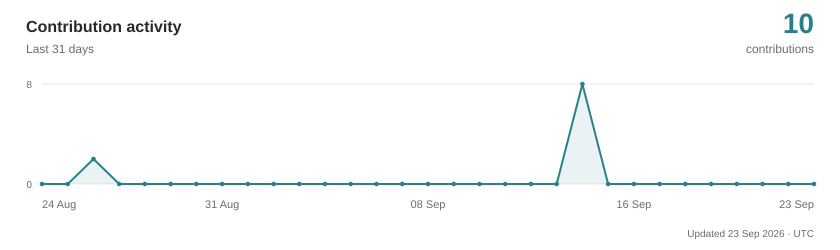
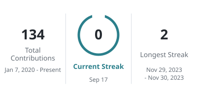

<h1 align="center">Maxim Botnev</h1>

<strong>Go Backend Developer</strong>

	<a href="https://t.me/twixzzzi">Telegram</a> &nbsp; · &nbsp;
	<a href="mailto:mgbotnev@gmail.com">Email</a> &nbsp; · &nbsp;
	<a href="./README.md">RU</a>

 

I write **Go** and build backends: APIs, services, integrations and data workflows. I build new systems and improve existing ones, from data models and business logic to deployment and maintenance.

## How I help

**Backend development.** I design and implement REST and gRPC APIs, background jobs and service-to-service communication. I aim for readable code and solutions that fit the problem.

**Data and performance.** I optimize SQL queries, implement caching and work with transactions. I investigate bottlenecks to make APIs faster and reduce unnecessary database work.

**Integrations and delivery.** I connect payment systems, external APIs, CRMs and messaging platforms. I set up containers, CI/CD, logging and monitoring to make services easier to release and maintain.

## Stack

`Go` · `PostgreSQL` · `MySQL` · `Redis` · `Docker` · `Linux`

I also work with PHP / Laravel and Node.js / TypeScript.

## Activity

<!-- Widgets are generated by .github/workflows/profile-widgets.yml. -->

	<a href="https://github.com/localmiracle">
		<picture>
			<source media="(prefers-color-scheme: dark) and (max-width: 600px)" srcset="./assets/widgets/activity-dark-mobile.svg">
			<source media="(max-width: 600px)" srcset="./assets/widgets/activity-light-mobile.svg">
			<source media="(prefers-color-scheme: dark)" srcset="./assets/widgets/activity-dark.svg">
			
		</picture>
	</a>

	<a href="https://github.com/localmiracle">
		<picture>
			<source media="(prefers-color-scheme: dark)" srcset="./assets/widgets/overview-dark.svg">
			
		</picture>
	</a>
	<a href="https://github.com/localmiracle">
		<picture>
			<source media="(prefers-color-scheme: dark)" srcset="./assets/widgets/streak-dark.svg">
			
		</picture>
	</a>

Public GitHub activity · refreshed daily

