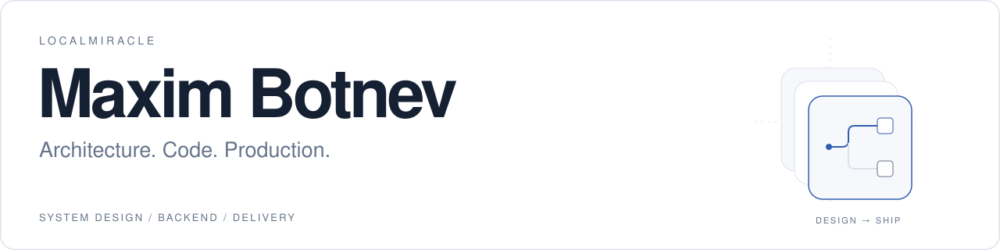

<!-- Profile README: localmiracle/localmiracle. Upload README.md, README.en.md and assets/ together. -->

<b>RU</b> / <a href="./README.en.md">EN</a>

<picture>
	<source media="(prefers-color-scheme: dark) and (max-width: 600px)" srcset="./assets/header-dark-mobile.svg">
	<source media="(max-width: 600px)" srcset="./assets/header-light-mobile.svg">
	<source media="(prefers-color-scheme: dark)" srcset="./assets/header-dark.svg">
	
</picture>

<strong>Solution Architect · Tech Lead · Backend Engineer</strong>

	<a href="https://t.me/twixzzzi">Telegram</a> &nbsp; / &nbsp;
	<a href="mailto:mgbotnev@gmail.com">Email</a> &nbsp; / &nbsp;
	<a href="https://github.com/localmiracle?tab=repositories">Репозитории</a>

 

## Профиль

Проектирую и разрабатываю backend-системы: от границ сервисов и модели данных до API, интеграций и развёртывания.

Совмещаю архитектурную работу с написанием кода. В фокусе — производительность баз данных, надёжность обработки транзакций, наблюдаемость и предсказуемый выпуск изменений.

## Инженерный фокус

**Архитектура.** Границы сервисов, микросервисы, распределённые и событийные системы.

**Производительность.** SQL-оптимизация, кеширование, очереди и идемпотентная обработка транзакций.

**Эксплуатация.** Контейнеризация, CI/CD, мониторинг, логирование и диагностика инцидентов.

**Интеграции.** Платёжные системы, KYC, CRM, Telegram и WhatsApp.

## Технологии

| Область | Инструменты |
| :--- | :--- |
| **Backend** | `Go` `PHP` `Laravel` `Node.js` `TypeScript` |
| **API** | `REST` `gRPC` `WebSockets` |
| **Данные** | `PostgreSQL` `MySQL` `Redis` `MongoDB` |
| **Платформа** | `Docker` `Kubernetes` `Linux` `Nginx` `GitLab CI/CD` |
| **Мониторинг** | `Prometheus` `Grafana` · нагрузочные тесты: `k6` `JMeter` |
| **Frontend** | `Vue` `React` `Next.js` |

## Публичный код

Инструменты, интеграции и продуктовые эксперименты с открытым кодом.

### [Chronograph](https://github.com/localmiracle/chronograph)

**Go · трассировки · CLI**

Инструмент для сбора и анализа span-событий. Фильтрация по длительности, построение сокращённого графа и вывод результатов в JSON или DOT. В репозитории — библиотека и CLI с демонстрационным сценарием.

### [GREEN-API Demo](https://github.com/localmiracle/green-api-demo)

**Node.js · TypeScript · Express**

Демо интеграции с WhatsApp через GREEN-API. Контроллеры, use cases и HTTP-сервис разделены; веб-интерфейс позволяет проверить настройки и отправить сообщение или файл.

<strong>Ещё один эксперимент: Telegram WebApp и 3D</strong>

 

[PC Mining](https://github.com/localmiracle/pc-mining-telegram-webapp) — игровой WebApp-прототип на `Next.js`, `React` и `React Three Fiber`: 3D-сцена, улучшения ПК и офлайн-прогресс. Платёжные операции демонстрационные; это не готовая платёжная интеграция.

## GitHub activity

График активности за последние 31 день. Статистика обновляется внешними сервисами.

	<a href="https://github.com/localmiracle">
		<picture>
			<source media="(prefers-color-scheme: dark)" srcset="https://github-readme-activity-graph.vercel.app/graph?username=localmiracle&amp;bg_color=0d1117&amp;color=919ba9&amp;line=8ab4f8&amp;point=8ab4f8&amp;area_color=8ab4f8&amp;area=true&amp;hide_border=true&amp;hide_title=true&amp;height=250&amp;radius=0&amp;days=31">
			
		</picture>
	</a>

	<a href="https://github.com/localmiracle">
		<picture>
			<source media="(prefers-color-scheme: dark)" srcset="https://streak-stats.demolab.com/?user=localmiracle&amp;hide_border=true&amp;background=0d1117&amp;ring=8ab4f8&amp;fire=8ab4f8&amp;currStreakNum=919ba9&amp;sideNums=919ba9&amp;currStreakLabel=8ab4f8&amp;sideLabels=919ba9&amp;dates=919ba9&amp;stroke=919ba9&amp;border_radius=0&amp;card_width=800">
			
		</picture>
	</a>

---

	<samp>ARCHITECTURE / BACKEND / DELIVERY</samp>  
	<a href="https://t.me/twixzzzi">@twixzzzi</a> &nbsp; · &nbsp;
	<a href="mailto:mgbotnev@gmail.com">mgbotnev@gmail.com</a>

